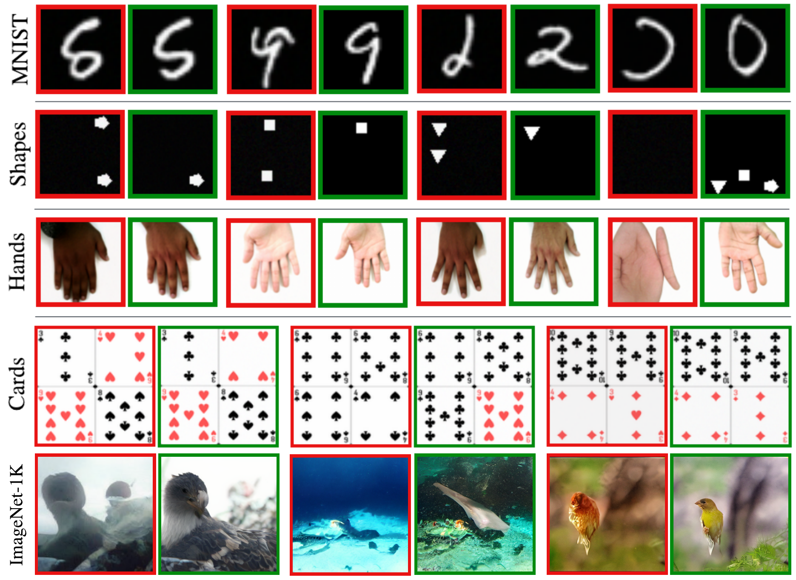

# 🎲 VSM : Score-Control for Hallucination Reduction in Diffusion Models

[Mahesh Bhosale](https://bhosalems.github.io/)<sup>1,\*</sup>, [Naresh Kumar Devulapally](https://scholar.google.com/citations?view_op=list_works&hl=en&hl=en&user=20vLrzMAAAAJ)<sup>1,\*</sup>, [Abdul Wasi](https://scholar.google.com/citations?user=_2friTYAAAAJ&hl=en)<sup>1</sup>, [Chau Pham](https://scholar.google.com/citations?user=LodGV1oAAAAJ&hl=en)<sup>1</sup>, [Vishnu Suresh Lokhande](https://scholar.google.com/citations?user=sC7B0iYAAAAJ&hl=en)<sup>1</sup>, [David Doermann](https://scholar.google.com/citations?user=RoGOW9AAAAAJ&hl=en)<sup>1</sup>

<sup>1</sup>University at Buffalo


[](https://arxiv.org/abs/2606.00377)
[](https://huggingface.co/datasets/mbhosale/VSM)


## 📖 Overview

This paper provides density-based view of hallucination in diffusion models and that motivates a lightweight training fix to curb hallucinations. Diffusion models suffer from hallucinations: implausible samples that fall outside the support of the true data distribution (e.g. hands with extra fingers, illegal chessboards). We provide a lower bound on off-manifold probability mass that leaks exponentially at a rate governed by the Lipschitz constant of the learned score: showing how overly *smooth* scores produce more hallucinations. Motivated by this, we introduce Variance-Guided Score Modulation (VSM), an architecture-agnostic training objective that counteracts excessive score smoothness by penalizing small score Jacobians, using a diagonal curvature proxy from variance learning under a time-dependent schedule. VSM plugs into a standard variance-learning loop and is toggled by a single hyperparameter `rho`.

<p align="center">
  
</p>

*Figure 1. Hallucinated generations (red) vs. VSM-corrected generations (green) across MNIST, Shapes, Hands, Cards, and ImageNet-1K. VSM suppresses off-manifold artifacts while preserving sample fidelity and diversity.*

## 📑 Contents
- [Overview](#-overview)
- [Repository Structure](#-repository-structure)
- [Installation](#-installation)
- [Datasets & Preparation](#-datasets--preparation)
- [Training](#-training)
  - [Pixel-space (DDPM-IP)](#pixel-space-ddpm-ip)
  - [Latent diffusion (LDM)](#latent-diffusion-ldm)
- [Sampling](#-sampling)
- [Evaluation](#-evaluation)
- [Acknowledgements](#-acknowledgements)
- [Citation](#-citation)


## 🗂 Repository Structure

```
VSM/
├── DDPM-IP/            # pixel-space DDPM + I-DDPM variance learning + VSM (built on DDPM-IP / guided-diffusion)
├── latent-diffusion/   # Latent Diffusion (LDM) + variance learning + VSM (built on CompVis/latent-diffusion)
├── datasets/           # download + load the proposed Cards & ChessImages datasets
├── evaluation/         # training-free hallucination detectors + FID/CLIP-FID/FLD metrics
├── fld/                # vendored FLD metric library (Jiralerspong et al. 2023)
└── assets/             # README teaser
```
We extend the I-DDPM from pixel space to Latent space because compvis/ldm does not have variance learning natively.

## 🚀 Installation

The project uses three conda environments — one per codebase — each with its own
pinned `requirements.txt`:

| Codebase | Env | Requirements |
|---|---|---|
| Pixel-space DDPM-IP / I-DDPM + VSM | `ADM` | [DDPM-IP/requirements.txt](DDPM-IP/requirements.txt) |
| Latent Diffusion (LDM) + VSM | `diff_haul` | [latent-diffusion/requirements.txt](latent-diffusion/requirements.txt) |
| Evaluation metrics (FID / CLIP-FID / FLD) | `fld` | [evaluation/requirements.txt](evaluation/requirements.txt) |

```bash
git clone https://github.com/bhosalems/VSM.git
cd VSM

# 1) Pixel-space DDPM-IP / I-DDPM + VSM  ->  env "ADM"
conda env create -f DDPM-IP/environment.yaml
conda activate ADM && pip install -r DDPM-IP/requirements.txt && pip install -e DDPM-IP

# 2) Latent Diffusion (LDM) + VSM  ->  env "diff_haul"
conda env create -f latent-diffusion/environment.yaml
conda activate diff_haul && pip install -r latent-diffusion/requirements.txt

# 3) Evaluation metrics (FID / CLIP-FID / FLD)  ->  env "fld"
conda create -n fld python=3.10 -y
conda activate fld && pip install -r evaluation/requirements.txt && pip install -e ./fld
```

The lightweight dataset helpers and training-free validators
(`datasets/`, `evaluation/{chess,cards,shapes}_validator.py`) run in almost any
environment — `pip install -r requirements.txt` (repo root) covers them.


## 📦 Datasets & Preparation

We release two benchmarks with very large semantic spaces and fast, training-free validators (see [datasets/README.md](datasets/README.md)):

| Dataset | Domain | Size | Resolution | Semantic classes |
|---|---|---|---|---|
| **Cards** | Playing cards | 94,000 | 128×128 | ~10⁵ |
| **ChessImages** | Chessboards | 190,000 | 256×256 | ~10⁴⁴ valid board states |

```bash
python -m datasets.download --dataset chess --out ./data/ChessImages
python -m datasets.download --dataset cards --out ./data/Cards
```

To train on your own data, point the loaders at any folder of images — see [datasets/README.md](datasets/README.md).


## 🏋️ Training

> VSM = **variance learning** (`learn_sigma` / `LearnedRange`) **+** the smoothness penalty weighted by **`rho`**. Setting `rho=0` recovers the variance-learning baseline.

### Pixel-space (DDPM-IP)

```bash
cd DDPM-IP
export PYTHONPATH=$PWD
mpirun -n 2 python scripts/image_train.py \
    --data_dir /path/to/ChessImages/train_images \
    --image_size 256 --learn_sigma True --rho 0.1 \
    --num_channels 256 --num_head_channels 64 --num_res_blocks 3 \
    --attention_resolutions 32,16,8 --resblock_updown True --use_new_attention_order True \
    --diffusion_steps 1000 --noise_schedule cosine --use_scale_shift_norm True \
    --rescale_learned_sigmas True --schedule_sampler loss-second-moment \
    --lr 1e-5 --batch_size 6 --use_fp16 True
```

See `DDPM-IP/scripts/train_*_smooth_*.bash` for ready-made per-dataset commands.

### Latent diffusion (LDM)

```bash
cd latent-diffusion
python main.py --base configs/latent-diffusion/chess-ldm-vq-f4_uc-lsmooth.yaml -t --gpus 0,
```

VSM is enabled in the config (`learn_sigma: true`, `var_type: LearnedRange`, `rho: 0.1`). The `*-finetune.yaml` configs attach a variance head to a pretrained checkpoint for variance-head-only fine-tuning (paper Table 4).


## 🔮 Sampling

```bash
# DDPM-IP
cd DDPM-IP && bash scripts/sample_batch.bash

# LDM (loops seeds, 100 samples each)
cd latent-diffusion && bash scripts/sample_batch_ddpm.bash
```

(Edit the checkpoint / output paths at the top of each script.)


## 📊 Evaluation

Training-free hallucination detectors and fidelity metrics live in [evaluation/README.md](evaluation/README.md). Each detector reports the hallucination rate (H%) over one or more seed folders:

```bash
# Hallucination rate
python -m evaluation.chess_validator  --gen-dir /path/gen/images
python -m evaluation.cards_validator  --gen-dir /path/gen --template-dir /path/Cards/templates
python -m evaluation.shapes_validator --gen-dir /path/gen

# FID / CLIP-FID / FLD / precision / recall
python -m evaluation.compute_metrics \
    --train-dir /path/train --test-dir /path/test --gen-dir /path/gen \
    --metrics fid clip_fid fld precision recall
```


## 🤝 Acknowledgements

This project builds on excellent open-source work: [DDPM-IP](https://github.com/forever208/DDPM-IP) / [guided-diffusion](https://github.com/openai/guided-diffusion), [Improved DDPM](https://github.com/openai/improved-diffusion), [Latent Diffusion](https://github.com/CompVis/latent-diffusion), and the [FLD](https://github.com/marcojira/fld) metric library. The ChessImages dataset uses [python-chess](https://python-chess.readthedocs.io) and FEN strings sampled from [VALUED](https://arxiv.org/abs/2311.12610). We thank the authors and curators of these resources for making them publicly available.

## 📑 Citation

If you find VSM useful, please cite:

```bibtex
@article{bhosale2026vsm,
  title   = {Score-Control for Hallucination Reduction in Diffusion Models},
  author  = {Bhosale, Mahesh and Devulapally, Naresh Kumar and Wasi, Abdul and
             Pham, Chau and Lokhande, Vishnu Suresh and Doermann, David},
  journal = {arXiv preprint arXiv:2606.00377},
  year    = {2026}
}
```
